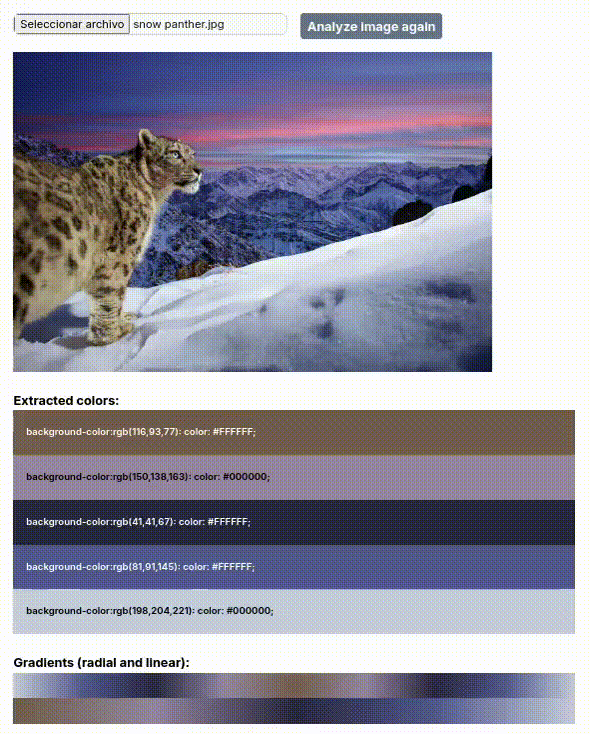
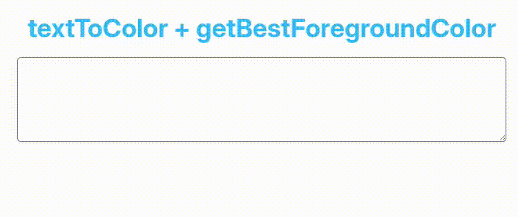
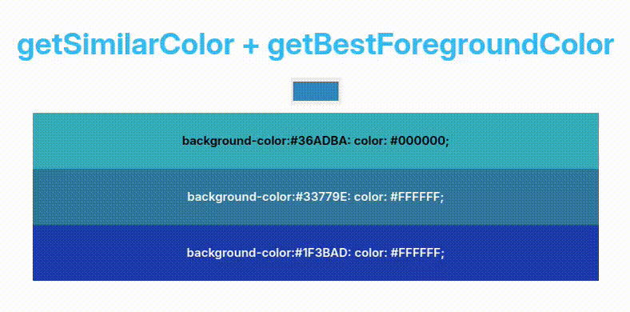

<div align="center">
  
  <p><b>Color Engine for PHP</b></p>
</div>

<div align="center">
    <a href="https://www.php.net/">= 8.2" src="https://img.shields.io/badge/PHP-%E2%89%A5 8.2-777BB4?style=flat-square&logoColor=white&labelColor=111827&color=4f5b93&label=PHP"></a>
    <a href="https://packagist.org/packages/tomloprod/colority"></a>
    <a href="https://github.com/tomloprod/colority/actions"></a>
    <a href="https://packagist.org/packages/tomloprod/colority"></a>
    <a href="https://packagist.org/packages/tomloprod/colority"></a>
</div>

## **About Colority**

**Colority** is a PHP library for working with colors. It handles conversions between RGB, HSL, Hex, and OKLCH formats, calculates WCAG-compliant contrast ratios, extracts color palettes from images, and more.

## **Features**

### Getting Started

- **[Instantiating Color Objects](#instantiating-color-objects)**
  - Create RGB, HSL, Hex, and OKLCH color objects from strings or arrays
  - Auto-detect color format with `parse()` method

- **[Contrast Ratio (WCAG 2.0)](#contrast-ratio-wcag-20-standard)**
  - **[getBestForegroundColor](#getbestforegroundcolor)**: Pick the best color from a list of candidates
  - **[getMatchingForegroundColor](#getmatchingforegroundcolor):** Generate a foreground color that matches the background's hue
  - **[getContrastRatio](#getcontrastratio):** Calculate contrast ratios between colors
  - **[ContrastRatioScore Enum](#contrastratioscore-enum):** Validate accessibility compliance

- **[Color Validation](#color-validation)**
  - Parse and validate color strings with type-specific parsers

- **[Color Conversion](#color-conversion)**
  - Convert between RGB, HSL, Hexadecimal, and OKLCH formats

### Color Utilities

- **[Color Adjustments](#color-adjustments)**: Adjust brightness and saturation
- **[getImageMostCommonColor](#getimagemostcommoncolor)**: Get the single most common color in an image
- **[getImageColors](#getimagecolors)**: Extract representative colors from images using K-Means clustering
- **[getImageDominantColors](#getimagedominantcolors)**: Extract dominant colors by pixel frequency with metadata
- **[textToColor](#texttocolor)**:   Generate deterministic colors from strings (_usernames, emails, etc._)
- **[getSimilarColor](#getsimilarcolor)**:   Get random colors in the same palette
- **[random](#random)**:   Generate completely random colors
- **[gradient](#gradient)**:   Create smooth color gradients between multiple colors

### Using Colority

- **[Ways of using Colority](#ways-of-using-colority)**
  - Helper function `colority()` and facade pattern

### Documentation & Resources

- **[API Reference](API.md)**: Complete documentation of all classes and methods
- **[Installation and Requirements](#installation-and-requirements)**: Get started with Composer

## **Getting Started**

### Instantiating Color objects

You can convert value colors (*strings or, additionally, depending on the color type, arrays*) to specific `Color` objects.

```php
/**
 * RGB format - Multiple input formats supported
 * 
 * @var RgbColor $rgbColor
 */
$rgbColor = colority()->fromRgb('rgb(255,255,255)');
$rgbColor = colority()->fromRgb('255,255,255');
$rgbColor = colority()->fromRgb([255, 255, 255]);

/** 
 * Hexadecimal format - With or without hash, shorthand supported
 * 
 * @var HexColor $hexColor 
 */
$hexColor = colority()->fromHex('#51B389');
$hexColor = colority()->fromHex('51B389');
$hexColor = colority()->fromHex('#ABC');

/**
 * HSL format - Multiple input formats supported
 * 
 * @var HslColor $hslColor
 */
$hslColor = colority()->fromHsl('hsl(168.31deg, 49.58%, 46.67%)');
$hslColor = colority()->fromHsl('168.31, 49.58, 46.67');
$hslColor = colority()->fromHsl([168.31, 49.58, 46.67]);

/**
 * OKLCH format - Multiple input formats supported
 * 
 * @var OklchColor $oklchColor
 */
$oklchColor = colority()->fromOklch('oklch(0.70 0.11 163)');
$oklchColor = colority()->fromOklch('0.70 0.11 163');
$oklchColor = colority()->fromOklch([0.70, 0.11, 163]);
```

If you cannot specify the original format of the value color, use the `parse()` method. It will auto-detect the color type and return the appropriate `Color` object, or `null` if the format is invalid.

```php
/** @var RgbColor|null $rgbColor */
$rgbColor = colority()->parse('rgb(255,255,255)');

/** @var HexColor|null $hexColor */
$hexColor = colority()->parse('#51B389');

/** @var HslColor|null $hslColor */
$hslColor = colority()->parse('hsl(168.31deg, 49.58%, 46.67%)');

/** @var OklchColor|null $oklchColor */
$oklchColor = colority()->parse('oklch(0.70 0.11 163)');

// Always returns null for invalid formats
$invalid = colority()->parse('not-a-color'); // null
```

---

### Contrast ratio (*WCAG 2.0 standard*)

When you have the `Color` object, you will be able to use all its methods. Below, we describe two of them related to the contrast ratio.

#### getBestForegroundColor

Returns a `Color` object with the most suitable foreground color (*using the Luminosity Contrast Ratio algorithm*). 

You can pass an array with `Color` objects as a parameter, so it chooses the foreground color with the best contrast ratio. If no parameter is specified, it will default to white or black.

```php
$hexColor = colority()->fromHex('#51B389');

/**
 * Automatic choice: Returns black or white, whichever has better contrast
 * 
 * @var HexColor $bestForegroundHexColor
 */
$bestForegroundHexColor = $hexColor->getBestForegroundColor();

/**
 * Custom palette: Chooses the best option from your brand colors
 * 
 * @var HexColor $bestForegroundHexColor
 */
$bestForegroundHexColor = $hexColor->getBestForegroundColor([
    new HexColor('#A63F3F'),
    new HexColor('#3FA684'),
    new HexColor('#6E3FA6'),
]);
```

#### getContrastRatio

Returns the contrast ratio (*higher is better contrast, lower is worse*) between the color invoking this method and the color passed as a parameter. If no color is passed as a parameter, the contrast ratio against black as foreground will be determined.

```php
$hexColor = colority()->fromHex('#51B389');

/**
 * Contrast ratio with black (default)
 * 
 * @var float $contrastRatio
 */
$contrastRatio = $hexColor->getContrastRatio();

/**
 * Contrast ratio with a specific foreground color
 * 
 * @var float $contrastRatio
 */
$contrastRatio = $hexColor->getContrastRatio(new HexColor('#3FA684'));
```

**Contrast ratio scale:**
- **1.0**: No contrast (same color)
- **3.0**: Minimum for UI components (WCAG AA)
- **4.5**: Minimum for normal text (WCAG AA)
- **7.0**: Enhanced contrast for normal text (WCAG AAA)
- **21.0**: Maximum contrast (black on white)

#### getMatchingForegroundColor

Generates a foreground color that **preserves the background's hue** while meeting WCAG contrast requirements.

> **Difference from `getBestForegroundColor`:**
> - `getBestForegroundColor()` picks the best color from a list of candidates (defaults to black/white)
> - `getMatchingForegroundColor()` generates a new color by adjusting lightness while keeping the same hue

```php
use Tomloprod\Colority\Support\Algorithms\ContrastRatioScore;

$backgroundColor = colority()->fromHex('#336699');

// AA level by default
$foregroundColor = $backgroundColor->getMatchingForegroundColor();

// AAA level for enhanced contrast
$foregroundColor = $backgroundColor->getMatchingForegroundColor(ContrastRatioScore::Excellent);

// With custom lightness step (faster but less precise)
$foregroundColor = $backgroundColor->getMatchingForegroundColor(
    targetScore: ContrastRatioScore::Good, 
    lightnessStep: 5 // the default value is 1
);
```

**Optional parameters:**
- `targetScore` *(default: ContrastRatioScore::Good)*: The desired contrast level. See [ContrastRatioScore Enum](#contrastratioscore-enum).
- `lightnessStep` *(default: 1)*: The amount of lightness points (1-100) to jump in each iteration while searching for a matching color. Larger values are faster but less precise.

#### ContrastRatioScore Enum

The `Tomloprod\Colority\Support\Algorithms\ContrastRatioScore` enum defines the standard contrast levels and provides helper methods to validate them.

**Available contrast levels:**
- `ContrastRatioScore::Excellent`: 7:1 ratio (WCAG AAA for normal text)
- `ContrastRatioScore::Good` *(default)*: 4.5:1 ratio (WCAG AA for normal text)
- `ContrastRatioScore::Acceptable`: 3:1 ratio (WCAG AA for large text/UI).
- `ContrastRatioScore::Insufficient`

You can also use the enum's static methods to manually check if a specific contrast ratio meets WCAG levels:

```php
/** @var HexColor $hexColor */
$hexColor = colority()->fromHex('#51B389');

/**
 * The `getContrastRatio` method can take a `Color` object as the foreground 
 * to calculate the contrast ratio against that color. Black is used by default.
 * 
 * @var float $contrastRatio
 */
$contrastRatio = $hexColor->getContrastRatio();

/**
 * AA Level for texts
 */
$passsesAALevelForLargeText = ContrastRatioScore::passesTextAALevel(
    contrastRatio: $contrastRatio,
    largeText: true
);

$passsesAALevelForNormalText = ContrastRatioScore::passesTextAALevel(
    contrastRatio: $contrastRatio,
    largeText: false
);

/**
 * AAA Level for texts
 */
$passsesAAALevelForLargeText = ContrastRatioScore::passesTextAAALevel(
    contrastRatio: $contrastRatio,
    largeText: true
);

$passsesAAALevelForNormalText = ContrastRatioScore::passesTextAAALevel(
    contrastRatio: $contrastRatio,
    largeText: false
);

/**
 * AA Level for Graphical Objects and User Interface Components
 */
$passsesAALevelForUI = ContrastRatioScore::passesUIAALevel(
    $contrastRatio
);

```

---

### Color validation

The concrete `Color` classes have a static method called `getParser()` which returns an instance of `ValueColorParser`.

The `parse` method returns a string with the value color adapted to work correctly with Colority or throws an `InvalidArgumentException` when it's not valid.

```php
use Tomloprod\Colority\Colors\HexColor;
use InvalidArgumentException;

$hexParser = HexColor::getParser();

try {

    // This will throw InvalidArgumentException
    $valueColor = $hexParser->parse('Not a valid value color');

} catch (InvalidArgumentException $e) {
    // Handle invalid color format
}

// Normalize shorthand: Returns "#FFFFFF"
$valueColor = $hexParser->parse('#FFF');
```

You can use the specific parser for any type of color:

```php
use Tomloprod\Colority\Colors\{HexColor, HslColor, RgbColor, OklchColor};

$hexParser = HexColor::getParser(); // Validates Hex format
$hslParser = HslColor::getParser(); // Validates HSL format
$rgbParser = RgbColor::getParser(); // Validates RGB format
$oklchParser = OklchColor::getParser(); // Validates OKLCH format
```

### Color conversion

Colority allows you to convert a Color object to any other `Color` object of the desired format.

```php
$hexColor = colority()->fromHex('#51B389');

/** @var HexColor $hexColor */
$hexColor = $hexColor->toHex();

/** @var RgbColor $rgbColor */
$rgbColor = $hexColor->toRgb();

/** @var HslColor $hslColor */
$hslColor = $hexColor->toHsl();

/** @var OklchColor $oklchColor */
$oklchColor = $hexColor->toOklch();
```

**Note:** Conversions between RGB, HSL, and Hex are lossless. Conversions involving OKLCH may be lossy (due to gamut clipping—OKLCH can represent colors outside the sRGB gamut that must be clipped to the nearest displayable color).

---

### Color utilities

#### Color Adjustments

Adjust the brightness (lightness) and saturation of any color. All methods return an `HslColor` that you can convert as needed.

```php
$color = colority()->fromHex('#3498db');

// Adjust brightness
$color->lighter(); // 10% brighter (default)
$color->lighter(20); // 20% brighter
$color->darker(); // 10% darker (default)
$color->darker(15); // 15% darker

// Adjust saturation
$color->saturate(); // 10% more saturated
$color->desaturate(25); // 25% less saturated

// Direct adjustment (positive or negative)
$color->adjustLightness(30); // +30% lightness
$color->adjustSaturation(-20); // -20% saturation

// Convert result to any format
$color->lighter()->toHex(); // Get as HexColor
$color->darker()->toRgb(); // Get as RgbColor
```

#### getImageMostCommonColor

Returns the single most common color in an image based on pixel frequency.

```php
/** @var RgbColor $mostCommon */
$mostCommon = colority()->getImageMostCommonColor(__DIR__.'/photo.png');

echo $mostCommon->toHex()->getValueColor(); // e.g., "#3A7B5C"
```

#### getImageColors

It allows you to obtain the colors detected in an image. As the first argument, the path to the image must be provided. 

It has an optional second parameter (default is 5) that specifies the number of colors to be returned.



```php
/** @var array<RgbColor> $imageColors */
$imageColors = colority()->getImageColors(
    imagePath: __DIR__.'/image-colors.png',
    desiredNumColors: 10
);
```

#### getImageDominantColors

Extracts the most dominant colors based on **pixel frequency**, returning detailed metadata for each color.

```php
use Tomloprod\Colority\Support\Dtos\ImageColorFrequency;

/** @var array<ImageColorFrequency> $dominantColors */
$dominantColors = colority()->getImageDominantColors(
    imagePath: __DIR__.'/photo.png',
    desiredNumColors: 5
);

foreach ($dominantColors as $frequency) {
    $frequency->color; // RgbColor object
    $frequency->percentage; // e.g., 45.2
    $frequency->pixelCount; // e.g., 4520
}
```

**Optional parameter:**
- `similarityThreshold` *(default: 50)*: Minimum RGB distance (0-441) to consider colors as distinct. Higher values filter out more similar colors.

```php
// More aggressive filtering (groups similar shades)
$dominantColors = colority()->getImageDominantColors(
    imagePath: __DIR__.'/photo.png',
    desiredNumColors: 5,
    similarityThreshold: 80
);
```

#### textToColor

Generate a deterministic color based on any string. Same input always produces the same color.



```php
/**
 * Basic usage - generates a unique color from text
 * 
 * @var HslColor $hslColor
 */
$hslColor = colority()->textToColor("Hi, I'm Tomás");
```

**Constrain to a color range:**

Pass a `fromColor` to generate only colors within the same hue range.

```php
/**
 * Only grayscale colors will be generated
 * 
 * @var HslColor $hslColor
 */
$hslColor = colority()->textToColor(
    "Hi, I'm Tomás", 
    colority()->fromHex('#CCC')
);
```

**Interpolate between two colors:**

Pass both `fromColor` and `toColor` to perform **linear interpolation**. The same text always maps to the same position in the gradient.

```php
/**
 * Color will fall somewhere between light green and dark teal
 * 
 * @var HslColor $hslColor
 */
$hslColor = colority()->textToColor(
    "Hi, I'm Tomás",
    colority()->fromHex('#85d5a4'), // Start: Light green
    colority()->fromHex('#165a59')  // End: Dark teal
);
```

#### getSimilarColor

Generate a random color similar to a given color (*within the same color palette*).



```php
$hexColor = colority()->fromHex('#51B389');

/**
 * Get a random similar color (default variation ranges)
 * 
 * @var HexColor $similarHexColor
 */
$similarHexColor = colority()->getSimilarColor($hexColor);

// Fine-tune the similarity with custom ranges
$similarHexColor = colority()->getSimilarColor(
    $hexColor,
    hueRange: 20, // +- 20 degrees on color wheel
    saturationRange: 5, // +- 5% saturation
    lightnessRange: 5 // +- 5% lightness
);
```

#### random

Generates a completely random color.

```php
/**
 * Returns a random HSL color
 * 
 * @var HslColor $randomColor
 */
$randomColor = colority()->random();

// And, if you want, convert to your preferred format
$hexRandom = $randomColor->toHex();
```

#### gradient

Generates a smooth gradient of colors between multiple color stops.

```php
/**
 * Create a 10-step gradient from red -> green -> blue
 * 
 * @var array<HexColor> $gradient
 */
$gradient = colority()->gradient(
    colors: [
        colority()->fromHex('#ff0000'), // Red
        colority()->fromHex('#00ff00'), // Green
        colority()->fromHex('#0000ff') // Blue
    ],
    steps: 10
);
```

This returns an array of 10 `HexColor` objects.

---

### Ways of using Colority

You can use Colority either with the helper function `colority()`:

```php
use Tomloprod\Colority\Colors\HexColor;

/**
 * Using the helper function
 * 
 * @var HexColor $hexColor
 */
$hexColor = colority()->fromHex('#CCC');
```

or by directly invoking the static methods of the `Colority` facade:

```php
use Tomloprod\Colority\Support\Facades\Colority;
use Tomloprod\Colority\Colors\HexColor;

/**
 * Using the facade directly
 * 
 * @var HexColor $hexColor
 */
$hexColor = Colority::fromHex('#CCC');
```

Both approaches are equivalent.


## **API Reference**

Colority provides a comprehensive API through its facade and color classes.

**[View complete API documentation](API.md)**


## **Installation and Requirements**

#### **Requires [PHP 8.2+](https://php.net/releases/)**

You may use [Composer](https://getcomposer.org) to install Colority into your PHP project:

```bash
composer require tomloprod/colority
```

## **Contributing**

Contributions are welcome, and are accepted via pull requests.
Please [review these guidelines](./CONTRIBUTING.md) before submitting any pull requests.

------

**Colority** was created by **[Tomás López](https://twitter.com/tomloprod)** and open-sourced under the **[MIT license](https://opensource.org/licenses/MIT)**.
